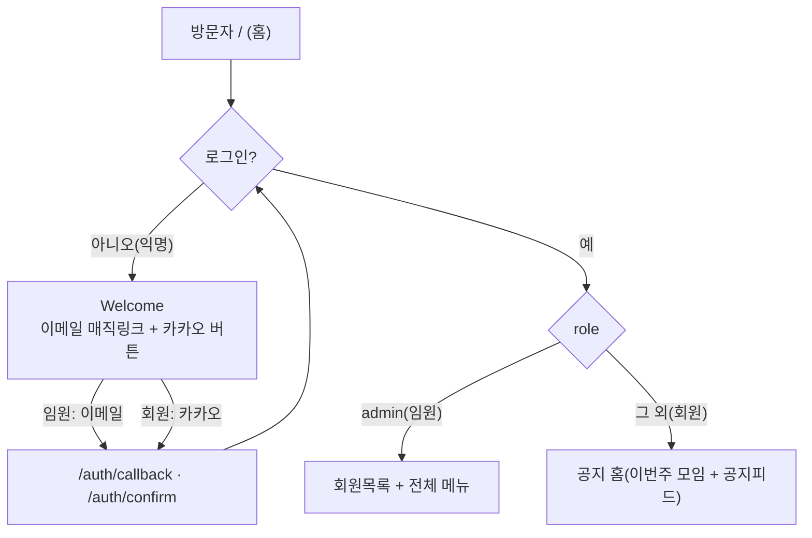
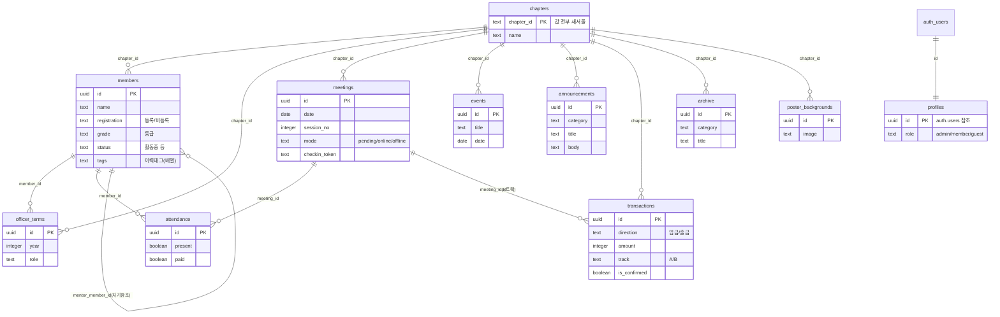

# 01 — 개요 (본체)

> 현재 코드 기준의 안정적 본문. 자주 바뀌는 이력은 [02-변경이력](02-변경이력.md), 미정/확인필요는 [03-할일과-참고](03-할일과-참고.md).

## 1. 정체와 목적
**새서울 CBMC '아름다운 만남'** 은 새서울 CBMC(기독실업인회) 조찬모임의 **운영 관리 웹앱**이다.
임원(간사)이 회원 명단·출석·식대·회계·공지·일정·콘텐츠를 한 화면에서 관리하고, 일반 회원은 로그인 후 공지를 확인한다. 고령 사용자 비중을 고려해 **본문 17px·단순 위계·파랑 단일 강조색**을 원칙으로 한다.

## 2. 도메인 규칙 (코드에서 도출)
- **단일 지회 전용**: 모든 주요 테이블에 `chapter_id`가 있으나 값은 전부 `'새서울'` 고정. 앱 쿼리는 `.eq("chapter_id","새서울")` 하드코딩, **RLS는 chapter_id를 보지 않는다**(역할 기반만). → 사실상 1개 지회 운영.
- **권한 3종** (`profiles.role`): `admin`(임원) / `member`(회원) / `guest`(관심·기본값).
  - 화면 분기는 **`admin` 이면 임원, 그 외(member·guest·없음)는 회원**으로 취급(`app/layout.tsx`, `app/page.tsx`).
  - 최초 admin은 `onjulyeo@gmail.com` 1명을 마이그레이션에서 지정.
- **로그인 신규 사용자**: `auth.users` insert 시 트리거 `handle_new_user`가 `profiles` 행을 `role='guest'`로 자동 생성.
- **회원 분류 3층**(`members`): ① 등록여부(등록회원/비등록) ② 등급(명예/정/부부/준/신입회원) ③ 상태(활동중/유보/등록전/OB). 이력 태그(`tags[]`)는 복수.
- **모임 모드**(`meetings.mode`): pending/online/offline. 오프라인일 때만 식대(`fee`)·납부 안내 적용.
- **회계 2트랙**(`transactions.track`): `A`=메인회계, `B`=식대정산. `direction`(입금/출금)·`category` 자동분류 후 사람이 `is_confirmed`로 확정.
- **현장 체크인**: 모임마다 `checkin_token`(16자 랜덤). `/checkin/[id]?t=토큰` 공개 링크로 회원이 직접 출석.

## 3. 인증·권한 흐름
- **임원**: 이메일 매직링크 — `signInWithOtp` → 메일 링크 → `/auth/callback`(code 교환) 또는 `/auth/confirm`(token_hash).
- **회원**: 카카오 OAuth — `signInWithOAuth({provider:'kakao'})` → `/auth/callback`. 카카오 동의항목은 닉네임·프로필사진·이메일 모두 **선택 동의**(이메일 미동의여도 로그인 통과, Supabase "Allow users without email" ON).
- **세션 유지**: `proxy.ts`(구 middleware)가 매 요청 세션 갱신만 함. **페이지 접근 차단(리다이렉트)은 미들웨어가 아니라 각 페이지에서 `getUser()`로 개별 처리.**

## 4. 구현된 화면·기능 (라우트 기준)
| 경로 | 역할 | 기능 |
|---|---|---|
| `/` | 공통 | 익명→Welcome / 회원→공지홈 / 임원→회원목록 |
| `/login` | 공통 | Welcome 재사용(이메일+카카오 로그인) |
| `/dashboard` | 임원 | 운영 대시보드(바로가기·요약) |
| `/members/[id]` `/new` `/import` | 임원 | 회원 상세(태그·사진)·신규등록·엑셀 일괄 가져오기 |
| `/schedule` | 임원 | 연간일정(`events`), 엑셀 가져오기/생성 |
| `/attendance` `/attendance/stats` | 임원 | 회차별 출석·식대 체크 / 출석 통계 |
| `/finance` `/import` `/transactions` `/report` | 임원 | 회계: 거래 가져오기·자동분류·내역·보고서 |
| `/content` | 임원 | 콘텐츠(포스터·경조사 안내 이미지) 생성 |
| `/notices` | 임원 | 공지 작성/관리(`announcements`) |
| `/archive` | 임원 | 아카이브·연혁 자료실 |
| `/roles` | 임원 | 로그인 사용자 권한 지정(`profiles`) |
| `/checkin/[id]` | 공개 | 현장 QR 체크인(토큰 검증, 앱셸 숨김) |
| `/preview-landing` | 공개 | 랜딩 미리보기 |
| `/auth/callback` `/confirm` `/signout` | 공통 | OAuth/매직링크 콜백·로그아웃 |
| `/api/occasion-extract` `poster-bg` `stock` | 내부 | 경조사 추출·포스터 배경·주가(외부 API 연동) |

**공용 모듈**(`lib/`): `classifyTxn`(거래 자동분류) · `exportTable`(표 내보내기) · `generateSchedule` · `parseMembersXlsx` · `parseScheduleXlsx` · `supabase/{client,server,middleware}`.

## 5. DB 스키마 (Supabase Postgres)

추가로 **Storage 버킷**: 회원사진·포스터배경·아카이브 이미지(공개 읽기 / 쓰기는 임원).

### RLS 요약 (역할 기반, chapter_id 미사용)
- `members`: **임원(admin)만 전체 권한**(개인정보 보호).
- `chapters` `officer_terms` `events` `announcements` `archive`: **로그인 시 조회**, 쓰기는 임원.
- `meetings` `attendance` `transactions` `poster_backgrounds`: **임원 전용**.
- `profiles`: 본인 조회 + 임원 전체 조회/수정.
- 임원 판별: `is_admin()` SECURITY DEFINER 함수(`profiles.role='admin'`).

## 6. 디자인 시스템 (정본값 = `app/globals.css` `@theme`)
| 토큰 | 값 | 용도 |
|---|---|---|
| `--color-primary` | `#0066cc` | **유일한 강조색** — 모든 클릭 요소(버튼·링크·선택) |
| `--color-primary-pressed` | `#0055aa` | 눌림 |
| `--color-navy` / `-deep` | `#1a2238` / `#141a2c` | 헤더 밴드·메시지 박스 배경(강조 아님) |
| `--color-deep` | `#243763` | 제목 강조 텍스트 |
| `--color-paper` | `#f5f5f7` | 페이지 배경(그라데이션 없음) |
| `--color-card` | `#ffffff` | 카드·입력 표면 |
| `--color-line` | `#e0e0e0` | 1px 테두리·구분선 |
| `--color-ink` / `-soft` / `--color-muted` | `#1d1d1f` / `#515154` / `#86868b` | 본문 / 보조 / 비활성 |
| 의미색 | 출석 `#0066cc` · 납부 `#2e7d52` · 미납 `#c0392b` · 경고 `#c47d1a` | 상태 신호 |
| 폰트 | `Pretendard` (단일) | 위계는 굵기·크기로만 |
| radius | sm 6 / md 9 / lg 13 / xl 16 px | 뱃지 / 입력 / 카드 / 패널 |
| 본문 | **17px**, line-height 1.6 | 고령 가독성 최우선 |

**원칙**(globals.css 주석): 강조색은 파랑 하나, 폰트는 Pretendard 하나, 무채색+파랑(그라데이션·금색·형광 금지), 그림자 절제(테두리로 구분).
> 컴포넌트 인라인 CSS(`SiteNav`·`Welcome`)는 동일 파랑(`#0066cc`)을 로컬 변수로 재사용한다. 포스터 편집기만 예외적으로 한글 장식 폰트(나눔명조·Black Han Sans 등)를 추가 로드.

## 7. 현재 제약·고정 상태
- **단일 지회 하드코딩** — 다지회 미지원(RLS도 chapter_id 격리 안 함).
- **카카오 이메일은 선택 동의** — 개인 개발자 비즈앱 전환으로 권한 확보(상세 [03](03-할일과-참고.md)).
- **권한 게이트가 페이지마다 분산** — 공통 미들웨어 차단 없음.
- 배포는 Vercel↔GitHub 연동에 의존(과거 끊김 사고 있었음 → [02](02-변경이력.md)).
