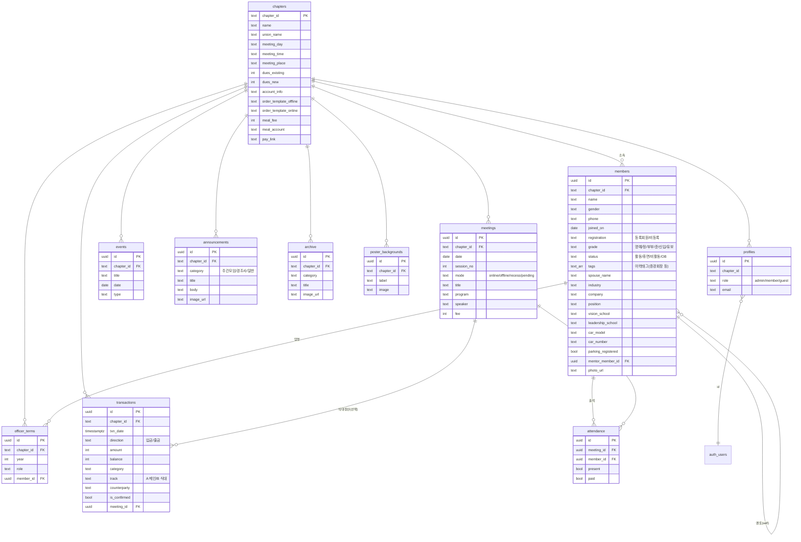
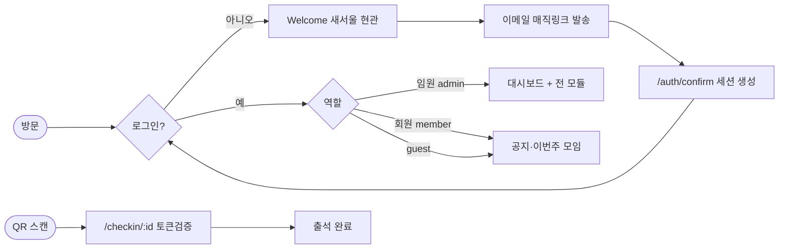

# 01 · 개요 (본체)

> 안정적인 본체. 자주 바뀌는 것은 [02-변경이력](02-변경이력.md) / [03-할일과-참고](03-할일과-참고.md)로.

---

## 1. 정체와 목적
**새서울 CBMC 아름다운 만남** — 기독실업인회 새서울지회의 금요 조찬 정기모임 운영 앱.
임원(회장·총무·간사)이 회원 명단부터 모임 일정·출석·식대·회계·공지·포스터까지 한 곳에서 처리한다. 사용자층에 고령 임원이 포함되어 **가독성·단순함이 제1원칙**.

## 2. 도메인 규칙 (코드에서 확인된 핵심 비즈니스 규칙)
- **회원 분류 3층 분리** (한 칸에 섞지 않는다):
  - **등록여부(registration):** `등록회원` / `비등록`
  - **등급(grade):** `명예회원` `정회원` `부부회원` `준회원` `신입회원` `유보회원` — 1인 1개, 회비 결정. (라이브 제약 6종 확정; 유보회원은 0002 이후 수동 추가→`0021`로 소급 기록)
  - **상태(status):** `활동` `휴면` `비활동` `OB` — 1인 1개, 참여/활동도 (0006/0007에서 옛 활동중/유보/등록전/OB에서 변경됨)
  - **이력태그(tags[]):** `증경회장` 등 복수. 평생 예우 직책은 태그(배지)로 표시
  - ※ "올해 임원(지회장·총무·간사 등)"은 태그가 아니라 별도 `officer_terms`(연도별)로 관리 — 평생예우 ≠ 1년 역할
- **회비:** 기존회원 600,000원 / 신입회원 650,000원 (`chapters.dues_*`). 유보·OB 면제. 부부회원 합산 1건.
- **식대 ≠ 회비:** 식대는 모임 밥값(`meetings.fee`/`attendance.paid`), 회비는 연간 회원회비(`transactions`). 완전 별개.
- **민감정보 저장 금지:** 주민번호·계좌번호 저장 안 함. (회원 테이블·거래 테이블 주석에 명시)
- **자동화 한계(정책):** 카톡 자동발송·통장 입금 자동확인 불가 → **문구 생성·복사**, 사람이 입금 체크.
- **권한:** `admin`(임원)만 회원 개인정보(members) 접근. `chapters`·`officer_terms`·`events`는 로그인 시 열람·임원만 수정. RLS는 `is_admin()`(security definer로 재귀 회피) 기반.
- **체크인:** 모임별 토큰으로 비로그인(anon) 자가 출석. 실수 시 체크아웃 가능.

## 3. 구현된 전 기능 (라우트 25개 기준)
- **인증:** `/login`·`/`(Welcome) 매직링크, `/auth/confirm`(token_hash 검증)·`/auth/callback`·`/auth/signout`. 세션 갱신은 `proxy.ts`(※ Next16에서 middleware→proxy 개명) + `lib/supabase/middleware.ts`.
- **홈/대시보드:** `/`(역할분기: 익명=Welcome / 회원=공지홈 / 임원=회원목록), `/dashboard`(임원 통계).
- **회원관리:** `/`(임원시 = `MembersList.tsx`), `/members/[id]`(상세·편집 전체폼), `/members/new`(추가), `/members/import`(엑셀). 현 화면은 **커스텀 클라이언트 컴포넌트**(통계 4칸·등급/상태/등록 필터·검색·열선택·데스크톱 표/모바일 카드) + 행 클릭 시 **오른쪽 상세 드로어**(보기/편집, **사진 업로드**·**태그 칩 편집**). ⚠️ 옛 `MembersTable.tsx`(@tanstack/react-table)는 **미사용 레거시**(임포트 안 됨, 정리 대상 → 03).
- **일정:** `/schedule`(`ScheduleBoard` — 자동생성·엑셀·이벤트·인라인편집·저장).
- **출석·식대:** `/attendance`(회차탭·QR·식대설정·납부체크·**미납자 SMS 버튼**·미납 독촉문구), `/attendance/stats`(`StatsView`), `/checkin/[id]`(QR 비로그인).
- **회계:** `/finance`→`/finance/transactions`(서브탭 공통, `FinanceTabs`), `/finance/import`(카뱅 자동분류), `/finance/report`(결산·인쇄).
- **공지:** `/notices`(`NoticesBoard`·회원홈 히어로 겸용). **콘텐츠:** `/content`(`ContentHub`→포스터 에디터·경조사). **아카이브:** `/archive`. **역할관리:** `/roles`(`RolesBoard` — 임원이 admin/member/guest 지정).
- **API:** `/api/occasion-extract`(Gemini), `/api/poster-bg`(Flux/Recraft), `/api/stock`.
- **모임온 랜딩:** `/preview-landing`(→ `Landing.tsx`, 프리뷰 전용).

## 4. DB 스키마 (Supabase, 마이그레이션 0001~0021)
모든 업무 테이블은 `chapter_id`로 지회에 묶인다(현재 값은 전부 `'새서울'`).

```mermaid
erDiagram
    chapters ||--o{ members : "소속"
    chapters ||--o{ meetings : ""
    chapters ||--o{ officer_terms : ""
    chapters ||--o{ events : ""
    chapters ||--o{ transactions : ""
    chapters ||--o{ announcements : ""
    chapters ||--o{ archive : ""
    chapters ||--o{ poster_backgrounds : ""
    chapters ||--o{ profiles : ""
    members  ||--o{ attendance : "출석"
    meetings ||--o{ attendance : "회차"
    meetings ||--o{ transactions : "식대정산(선택)"
    members  ||--o{ officer_terms : "임명"
    members  ||--o{ members : "멘토(self)"
    profiles }o--|| auth_users : "id"

    chapters {
      text chapter_id PK
      text name
      text union_name
      text meeting_day
      text meeting_time
      text meeting_place
      int  dues_existing
      int  dues_new
      text account_info
      text order_template_offline
      text order_template_online
      int  meal_fee
      text meal_account
      text pay_link
    }
    members {
      uuid id PK
      text chapter_id FK
      text name
      text gender
      text phone
      date joined_on
      text registration "등록회원/비등록"
      text grade "명예/정/부부/준/신입/유보"
      text status "활동/휴면/비활동/OB"
      text_arr tags "이력태그(증경회장 등)"
      text spouse_name
      text industry
      text company
      text position
      text vision_school
      text leadership_school
      text car_model
      text car_number
      bool parking_registered
      uuid mentor_member_id FK
      text photo_url
    }
    meetings {
      uuid id PK
      text chapter_id FK
      date date
      int  session_no
      text mode "online/offline/recess/pending"
      text title
      text program
      text speaker
      int  fee
    }
    attendance {
      uuid id PK
      uuid meeting_id FK
      uuid member_id FK
      bool present
      bool paid
    }
    transactions {
      uuid id PK
      text chapter_id FK
      timestamptz txn_date
      text direction "입금/출금"
      int  amount
      int  balance
      text category
      text track "A 메인/B 식대"
      text counterparty
      bool is_confirmed
      uuid meeting_id FK
    }
    officer_terms {
      uuid id PK
      text chapter_id FK
      int  year
      text role
      uuid member_id FK
    }
    announcements {
      uuid id PK
      text chapter_id FK
      text category "주간모임/경조사/일반"
      text title
      text body
      text image_url
    }
    events {
      uuid id PK
      text chapter_id FK
      text title
      date date
      text type
    }
    archive {
      uuid id PK
      text chapter_id FK
      text category
      text title
      text image_url
    }
    poster_backgrounds {
      uuid id PK
      text chapter_id FK
      text label
      text image
    }
    profiles {
      uuid id PK
      text chapter_id
      text role "admin/member/guest"
      text email
    }
```
- **함수/트리거:** `is_admin()`, `handle_new_user`(가입 시 profile 자동생성), `checkin_roster`·`check_in`·`check_out`·`checkin_info`·`set_meal_settings`·`get_meal_settings`. ⚠️ 이 함수들 내부도 `chapter_id='새서울'` 고정.
- **Storage 버킷:** `archive`, `backgrounds`, `posters`, `member-photos`(모두 공개 읽기·임원 쓰기).
- **실제 데이터 현황(라이브 확정, 2026-06-10):** 회원 **53명** — 등급 정회원 31·부부회원 9·명예회원 8·준회원 4·유보회원 1(신입 0) / 상태 활동 51·비활동 1·휴면 1. (Supabase SQL Editor 직접 조회로 확정. 임포트 0007 직후 활동52/휴면2에서 임원이 2건 손수정)

## 5. 사용자 흐름

```mermaid
flowchart LR
    start([방문]) --> q{로그인?}
    q -->|아니오| welcome[Welcome 새서울 현관]
    welcome --> otp[이메일 매직링크 발송]
    otp --> confirm["/auth/confirm 세션 생성"]
    confirm --> q
    q -->|예| role{역할}
    role -->|임원 admin| dash[대시보드 + 전 모듈]
    role -->|회원 member| feed[공지·이번주 모임]
    role -->|guest| feed
    qr([QR 스캔]) --> checkin["/checkin/:id 토큰검증"] --> done[출석 완료]
```

## 6. 디자인 시스템 (★현재 = 이중 토큰 구조)
> ⚠️ 옛 `DESIGN.md`의 남색+금색+명조는 **폐기**. 2026-06 디자인 전면 개편(claude.ai/design)으로 **거의 모든 화면이 "모임온 디자인 시스템"으로 재이식**됐다. 그 결과 토큰이 **두 군데**에 산다 — 둘은 **primary `#0066cc`만 공유**하고 무채색 계열이 미세하게 다르다. 헷갈리지 말 것.

**(a) 베이스/레거시 — `app/globals.css @theme`** (Tailwind v4 유틸 + `<body>` 배경 + 아직 개편 안 한 일부 서버 페이지)
- 강조 `primary #0066cc`(눌림 `#0055aa`·포커스 `#0071e3`) / 남색 `navy #1a2238`·`deep #243763`
- 표면 `paper #f5f5f7`(배경)·`card #ffffff`·`line #e0e0e0` / 텍스트 `ink #1d1d1f`·`ink-soft #515154`·`muted #86868b`
- 의미색 `present #0066cc`·`success #2e7d52`·`unpaid #c0392b`·`warning #c47d1a` / 모서리 sm6·md9·lg13·xl16
- 본문 **17px**, line-height 1.6 (고령 가독성)

**(b) 개편 화면 — 화면별 스코프 `.moim-*` CSS** (대시보드·회원·출석·체크인·통계·회계·콘텐츠·공지·회원홈·로그인·역할관리·셸·Welcome 등 = 현재 화면 대부분)
- 각 컴포넌트가 ``를 주입하고 **모든 선택자를 `.moim-셸/.moim-dash/.moim-mem/.moim-fin/.moim-att/.moim-nt/.moim-ev/.moim-roles/.moim-welcome` 등으로 프리픽스** → 전역 누수 차단(개편 안 된 페이지에 영향 없음)
- 토큰을 그 루트에 CSS 변수로 재정의: `--brand #0066cc`(공통), 텍스트 `--ink #16181d`·`--ink-2 #3d424d`·`--ink-3 #767d8a`, `--line #ecedf0`, `--bg #ffffff`·`--bg-warm #fafafb`, `--brand-soft #e8f1fc`, 녹색 `#0a7d3f` / 모서리 **버튼 14·카드 20**, 그림자 옅게
- 즉 (a)와 (b)는 **파랑은 같고**, 무채색은 (b)가 약간 더 따뜻·연함(애플식 → 모임온식)

**공통 규칙**
- **폰트:** 전부 **Pretendard 하나**(jsDelivr CDN), 위계는 굵기·크기로만. 아이콘 **lucide**. (포스터 에디터 전용으로 Nanum Myeongjo·Black Han Sans·Gaegu·Nanum Pen Script·Do Hyeon 추가 로드)
- **그라데이션·금색·형광 금지**(단, 회원홈 모임카드·CTA·경조사 카드처럼 의도된 파랑 그라데이션은 예외), 그림자 절제.
- **구현 패턴(개편 화면 공통):** ① 서버 `page.tsx`=데이터 로더 → 표현 컴포넌트(`DashboardView`·`StatsView`·`RolesBoard` 등)로 분리, ② **"새 디자인 + 기존 실기능 보존" 머지** — 시안이 단순화로 빼먹은 기능(식대 납부체크·미납 SMS·포스터 AI/스톡/보관함·일정 자동생성/이벤트)은 반드시 유지.
- 레이아웃: `<main className="max-w-[1120px] px-[18px] md:px-6 …">`. 익명/`/checkin`/`/preview-landing`에선 `SiteNav` 숨김.
- 로고: 헤더·Welcome은 실제 CBMC 로고 `public/cbmc-symbol.webp`(클로드디자인 업로드분 추출), `object-fit:contain`. 구 `cbmc-logo.png`는 포스터 에디터가 사용(흰색 invert).

## 7. 새서울(운영) vs 모임온(판매) 분리 현황 (진단 기준선, 2026-06-10)
**한 줄 결론: 운영의 99%가 새서울 전용(A). 모임온(B)은 코드 분기 없음. 둘이 공유하는 기반(C)은 스키마·유틸뿐.**

- **단일 지회 고정(A):** `chapter_id='새서울'`이 **쿼리 필터 23곳 + insert/DB함수 7곳 ≈ 30곳**에 하드코딩. 로그인 사용자의 지회를 동적으로 읽는 로직 **없음**.
- **멀티테넌트 = 미행사(C):** `chapters` 테이블·`chapter_id` FK·RLS로 여러 지회를 **담을 수는 있으나** seed는 새서울 1행뿐, 한 번도 행사된 적 없음.
- **전역 admin(A):** `profiles.role=admin`은 전역 1종. "**지회별 관리자**" 개념 없음 → 테넌트 격리 불가.
- **브랜딩 고정(A):** 제목·메타·환영문구·포스터·SMS에 "새서울 CBMC" 하드코딩(~55곳). 2026-06 개편으로 **헤더 = "CBMC 새서울지회"**·첫화면 = `Welcome`(새서울)로 오히려 더 새서울에 박힘.
- **모임온 자산(B, 불활성):** `Landing.tsx`(범용 판매 랜딩) + `.moimon` 스코프 CSS는 존재하나 **`/preview-landing`에만 격리**, 실서비스 동선(`/`=Welcome 새서울)엔 없음.
- **공유 기반(C):** `lib/supabase/*`, `parseMembersXlsx`·`classifyTxn`·`generateSchedule`·`exportTable` 등 순수 유틸 + 멀티테넌트-가능 스키마.

> ⚠️ **"디자인은 모임온, 제품은 새서울"** — 2026-06 전 화면을 *모임온 디자인 시스템*으로 입혔지만, **브랜딩·데이터·인증은 전부 새서울 고정(A)**이라 제품은 여전히 단일 지회다. 디자인 톤 통일 ≠ 멀티테넌트화.
> 📌 **전략 결정(2026-06-11):** 판매용 모임온은 *CBMC용·일반용 따로*가 아니라 **하나의 설정가능 멀티테넌트 제품**으로, **새서울과 완전 분리(새 이름·새 repo·새 DB)** 한다. **새서울 = 고객 1**. 착수 전 **PRD 먼저**. → 03 향후방향.

> ✅ **기획 범위 초과 구현:** 옛 사양서는 "회원관리만"이었으나, 실제론 회비·주간(일정)·출석·회계·공지·아카이브 **전 모듈이 구현**됨. QR체크인·AI포스터(Flux/Recraft)·경조사 AI추출(Gemini)·카뱅 회계 임포트는 사양서에 없던 기능. → **코드가 사양서를 크게 앞섰다.** 사양서는 참고용 과거 문서.
