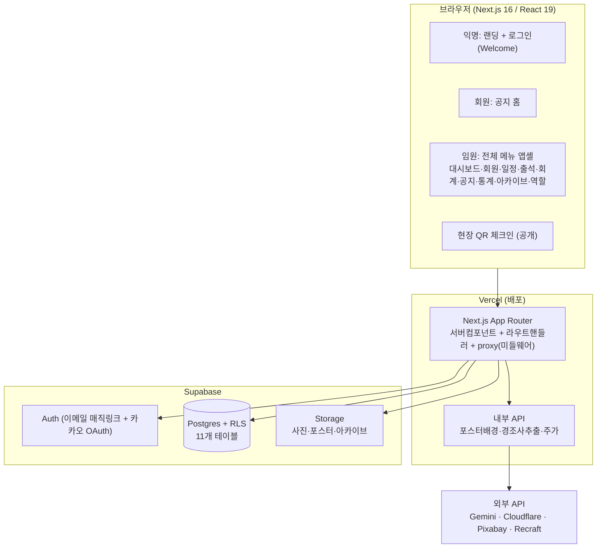

# 새서울 CBMC '아름다운 만남' — 한장본 (정본 표지)

> 이 문서 하나로 앱 전체를 파악한다. 상세는 [01-개요](01-개요.md) · [변경이력](02-변경이력.md) · [할일과 참고](03-할일과-참고.md).
> **기준: 지금 실제로 돌아가는 코드** (사양서·기획문서가 아니라 현재 구현물).

## 한 줄 정의
새서울 CBMC 조찬모임을 운영·관리하는 **웹앱** — 회원관리를 중심으로 출석·식대·회계·공지·일정·콘텐츠까지 임원이 한곳에서 처리하고, 회원은 공지를 본다.

## 현재 상태 (2026-06-14)
- **프로덕션 라이브**: https://cbmc-app.vercel.app (Vercel 자동배포, GitHub `onjulyeo-bit/newseoul_worklog-app`의 `main`)
- **로그인 2종 가동**: 임원=이메일 매직링크 / 회원=카카오 로그인(2026-06-14 라이브)
- **단일 지회 전용**: 모든 데이터의 `chapter_id`가 `'새서울'` 고정 (코드 하드코딩)

## 핵심 기능 (실제 구현 기준)
- **회원관리** — 목록·상세·태그·사진, 엑셀 일괄 가져오기
- **출석·식대** — 회차별 출석/납부 체크, 현장 QR 체크인
- **회계** — 거래내역 가져오기·자동분류(A 메인/B 식대), 보고서
- **공지 / 연간일정 / 아카이브** — 회원 대상 공지, 행사 일정, 연혁 자료실
- **콘텐츠** — 포스터·경조사 안내 이미지 생성(외부 API 연동)
- **역할관리** — 임원이 로그인 사용자 권한(admin/member/guest) 지정

## 전체 구조

## 기술 스택
- **프레임워크**: Next.js 16 (App Router, `proxy.ts`=구 middleware) · React 19 · TypeScript
- **스타일**: Tailwind CSS v4 (`@theme` 토큰) + 컴포넌트 인라인 CSS · 폰트 Pretendard
- **백엔드/DB**: Supabase (Postgres·Auth·Storage, `@supabase/ssr`)
- **데이터 처리**: xlsx(엑셀), qrcode(QR), html-to-image(이미지화)
- **배포**: Vercel (main 자동배포)
