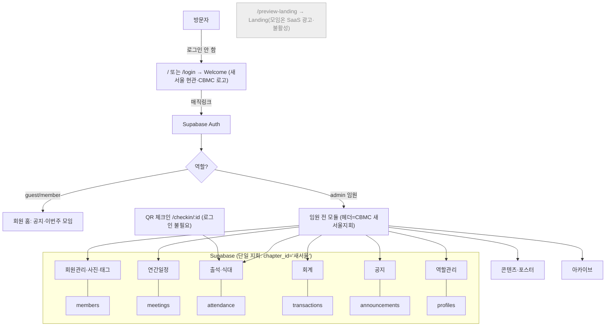

# 새서울 CBMC 앱 — 정본 한장본 (표지)

> 이 폴더(`docs/report/정본/`)가 이 프로젝트의 **단일 진실(定本)**이다.
> 흩어진 옛 사양서·DESIGN.md·design-briefs와 코드가 다르면 **언제나 현재 코드가 진실**.
> 갱신일: **2026-06-11**

---

## 한 줄 정의
**기독실업인회(CBMC) 새서울지회의 금요 조찬모임을 운영하는 웹앱.** 회원·일정·출석·식대·회계·공지·포스터를 임원이 한 곳에서 관리한다.

## 현재 상태 (2026-06-11)
- **배포:** **`cbmc-app.vercel.app` 라이브 운영 중.** `git push origin main` + `npx vercel --prod`로 배포. (과거 "확인 필요"였던 배포 항목 해소)
- **디자인:** **전 화면 디자인 개편 완료** — claude.ai/design의 핸드오프 번들을 받아 "모임온 디자인 시스템"(파랑 #0066cc·Pretendard·lucide·둥근 카드)으로 13개 화면 + 첫화면 전부 재이식. **"새 디자인 + 기존 실기능 100% 보존" 머지** 원칙으로 작업(시안이 빼먹은 기능은 살림). 화면별 CSS는 `.moim-*`로 스코프(전역 누수 방지) — `globals.css`와 **이중 토큰** 구조(01 §6).
- **첫 화면:** 익명 방문자는 `/`에서 **새서울 CBMC 환영+로그인**(`Welcome.tsx`, 실제 CBMC 로고 `cbmc-symbol.webp`). `/login`도 동일 화면으로 통일. 헤더 브랜드 = **"CBMC 새서울지회"**(모임온 로고 아님).
- **로그인:** 이메일 매직링크(비밀번호 없음), 역할 admin/member/guest. **`/roles` 역할관리 화면**으로 임원이 권한 지정.
- **가동 범위:** 새서울지회 **단일 지회 전용**. `chapter_id='새서울'` 하드코딩 ~30곳(멀티테넌트는 스키마만 가능, 미행사). 01 §7.
- **회원 데이터:** 실제 명단 **53명**(라이브 확정). 등급 정31·부부9·명예8·준4·유보1 / 상태 활동51·비활동1·휴면1.
- **판매용 "모임온" 방향:** 코드 분기는 여전히 **0(미착수)**. 단 **전략 결정됨** — "CBMC/일반 따로가 아니라 **하나의 설정가능 멀티테넌트 제품**으로, 새서울과 **완전 분리**(새 이름·새 repo)". 착수 전 **PRD 먼저**. (03 향후방향)
- **회원 실오픈 미결:** 기본 매직링크의 **rate limit 실제 확인됨**(테스트 중 초과). 다수 로그인 전 **Gmail SMTP** 또는 **회원 로그인 없이(공개 공지 링크)** 중 택1 — 미결(03).

## 핵심 기능 (실제 구현 기준)
| 모듈 | 상태 | 핵심 |
|------|:---:|------|
| 인증·권한 | ✅ | 매직링크 로그인, 역할별 화면, RLS, **역할관리(`/roles`)** |
| 회원관리 | ✅ | 명단 표(정렬·필터·검색·열선택), 상세 **드로어**(보기/편집), **사진 업로드·태그 편집**, 엑셀 임포트, 이력 배지 |
| 연간일정 | ✅ | 회차·모드(온/오프/휴회/미정)·프로그램, 자동생성·엑셀·이벤트 |
| 출석·식대 | ✅ | 출석/납부 체크, QR 자가 체크인, **미납자 SMS 버튼**, 식대 설정, 출석통계 |
| 회계 | ✅ | 카뱅 엑셀 자동분류, 거래내역 인라인수정, 결산 보고서(인쇄/PDF) |
| 공지 | ✅ | 임원 작성/회원 열람, 포스터 이미지, 카테고리 필터 |
| 콘텐츠·포스터 | ✅ | 포스터 에디터(드래그·AI/스톡/보관함 배경), 경조사 AI 추출 |
| 아카이브 | ✅ | 사진·연혁 보관 |

## 기술 스택
Next.js **16.2.6** (App Router) · React **19.2** · Supabase(Postgres+Auth+Storage, `@supabase/ssr`) · Tailwind **v4**(`globals.css @theme`) + **화면별 스코프 CSS** · `lucide-react` · `@tanstack/react-table`(레거시) · 외부 AI: Cloudflare Flux/Recraft(포스터), Gemini(경조사 추출), Pixabay(스톡).

## 전체 구조 (한눈에)

```mermaid
flowchart TD
    V[방문자] -->|로그인 안 함| W["/ 또는 /login → Welcome (새서울 현관·CBMC 로고)"]
    W -->|매직링크| AUTH[Supabase Auth]
    AUTH --> ROLE{역할?}
    ROLE -->|guest/member| HOME["회원 홈: 공지·이번주 모임"]
    ROLE -->|admin 임원| ADMIN["임원 전 모듈 (헤더=CBMC 새서울지회)"]

    ADMIN --> M[회원관리·사진·태그]
    ADMIN --> S[연간일정]
    ADMIN --> A[출석·식대]
    ADMIN --> F[회계]
    ADMIN --> N[공지]
    ADMIN --> C[콘텐츠·포스터]
    ADMIN --> AR[아카이브]
    ADMIN --> R[역할관리]

    QR["QR 체크인 /checkin/:id (로그인 불필요)"] --> A

    subgraph DB["Supabase (단일 지회: chapter_id='새서울')"]
      M --- members
      S --- meetings
      A --- attendance
      F --- transactions
      N --- announcements
      R --- profiles
    end

    LP["/preview-landing → Landing(모임온 SaaS 광고·불활성)"]:::inert
    classDef inert fill:#eee,stroke:#aaa,color:#888;
```
> 회색 `Landing`은 범용 판매 랜딩이지만 **프리뷰 경로에만** 남아 실서비스 동선엔 없다(첫화면은 `Welcome` 새서울). 모임온 SaaS는 별도 제품·별도 repo로 새로 만들 예정(03).

---
**다음 장:** [01-개요](01-개요.md) · [02-변경이력](02-변경이력.md) · [03-할일과-참고](03-할일과-참고.md)
